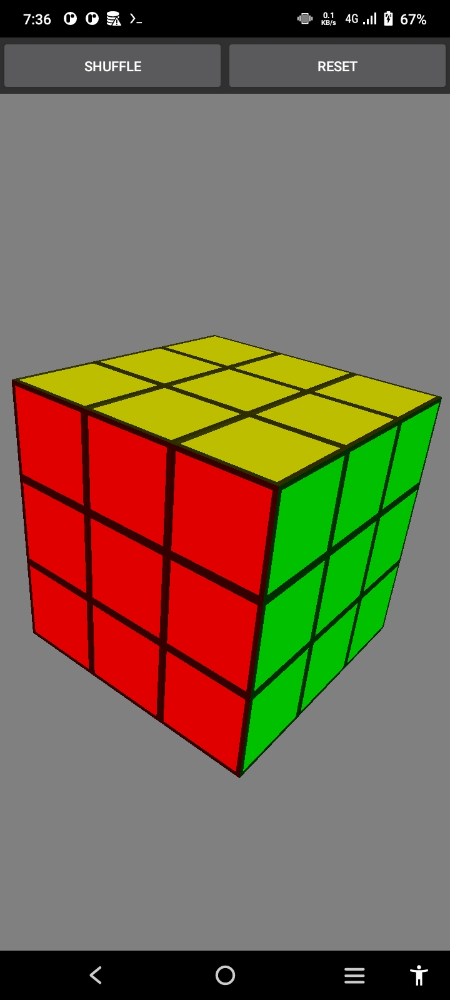
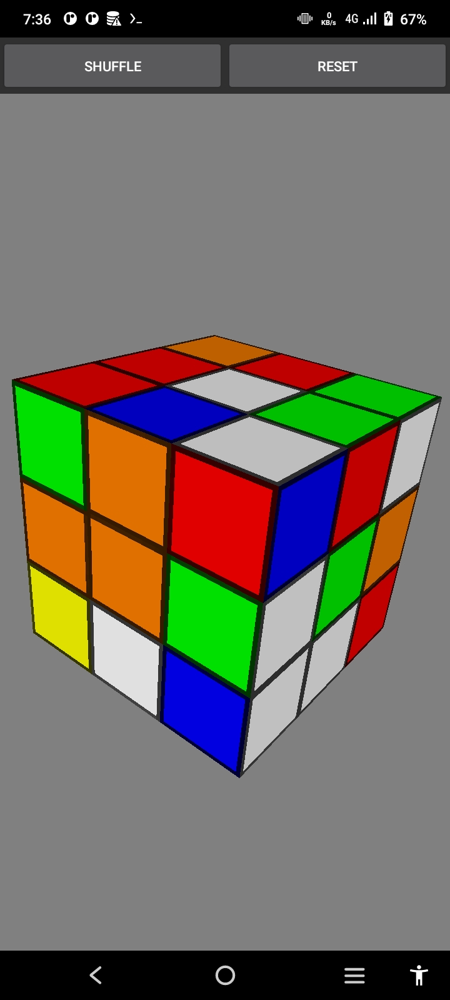

# Rubik Cube
Simple 3x3 rubik cube made from scratch rendered manually with openGL 2.0.

Current feature:
- Animation (include shuffle animation)
- Simple shuffling
- Reset state

## Preview

## Download
Open release section to [download](https://github.com/yeaayy/rubik-cube/releases/latest).
